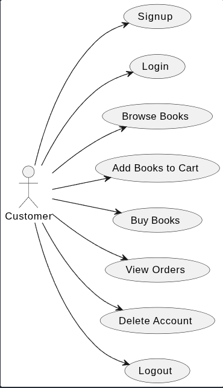
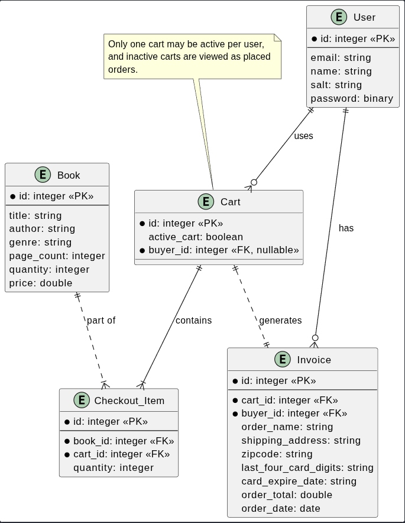
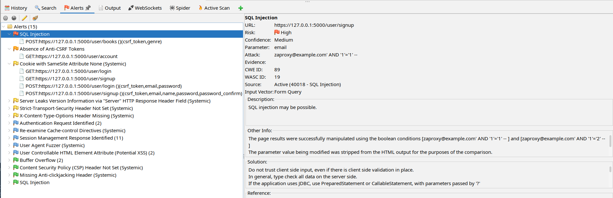
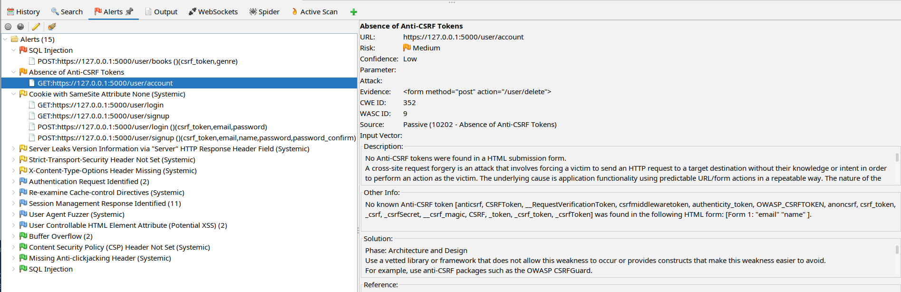
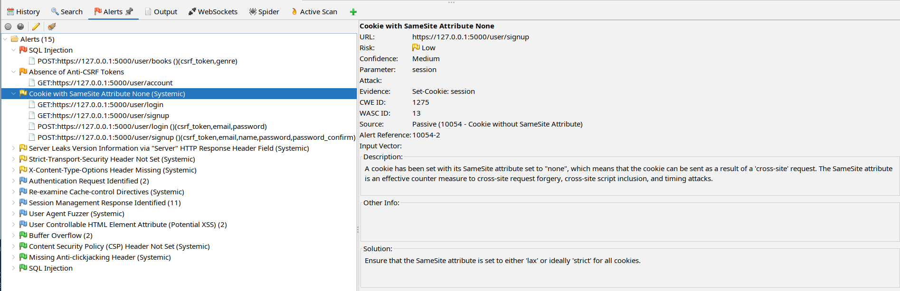

# Book Worm

Book Worm is an intentionally vulnerable bookstore that was created to demonstrate insecure coding practices and the security risks they create within an e-commerce platform. This bookstore application simulates a simple e-commerce platform that provides users with a straightforward book shopping experience.

---


### Quick Links

* [How to Run Book Worm](#how-to-run-book-worm)
* [Proof-of-Concept Demonstrations](#proof-of-concept-demonstrations)
* [Security Scan Results](#security-scan-results)

### Technology Used

The bookstore was developed using the Python Flask framework, and utilizes a SQLite database with database interactions facilitated through the SQLAlchemy ORM. Additionally, the application is run using an ad-hoc SSL certificate so security analysis remains focused on implementation-level vulnerabilities and not the transport-layer security issues.

### Key Vulnerable Features

* Weak cryptographic practices with user password hashing
* ORM misuse resulting in unparameterized SQL queries vulnerable to injection
* An unprotected route handling a sensitive user account action vulnerable to cross-site request forgery (CSRF) attacks
* Broken access control exposing user invoices through insecure direct object references (IDOR)

### Key Non-Vulnerable Features

* A password policy
* Client-side input validation for forms
* Realistic add-to-cart and checkout functionality
* Ability to view previous orders

### System Models

The following PlantUML diagrams were included to help visualize the system's key user features and structural design.

#### Use Case Diagram

The use case diagram defines how users interact with the bookstore application.



#### Entity Relationship Diagram in Crow's Foot Notation

The entity relationship diagram illustrates the database objects used within the web application and their relationships, highlighting key e-commerce operations.



---

## How to Run Book Worm

#### **Note: These instructions are for the Linux and MacOS operating systems. Windows users will have to adjust the following commands to run the application.**

1. Clone the repository: `git clone https://github.com/msteenstu/3024-Final-Project.git`
2. Ensure you are in the project's root directory
3. Install the Python virtual environment: `python3 -m venv .venv`
4. Activate the virtual environment: `source .venv/bin/activate`
5. Install the project's dependencies: `pip3 install -r requirements.txt`
6. Export the application's secret key as an environment variable: `export SECRET_KEY="$(python -c 'import secrets; print(secrets.token_hex())')"`
7. Export the environment variable to run the application: `export FLASK_APP=src/app`
8. Run the application with an auto-generated, self-signed certificate: `flask run --cert=adhoc`
9. Navigate to: `127.0.0.1:5000`

---


### Example Test Users for Book Worm

To test Book Worm's normal bookstore features, such as signing up, adding books to the cart, and placing orders, one can use the following test users and navigate through the application normally. These users were used to create the proof-of-concept demonstrations and can also be used to follow the outlined demonstration steps.

| User          | Email                | Password      |
| ------------- | -------------------- | ------------- |
| Percy Jackson | avidreader@gmail.com | Blue@ocean#12 |
| Ada Lovelace  | type4fun@yahoo.com   | HelloWorld1!  |

## Proof-of-Concept Demonstrations

Detailed exploit demonstrations, risk analysis, code snippet breakdowns, and brief remediation guidance for each intentionally implemented vulnerability can be found in the [Proof-of-Concept documentation](proof_of_concept/proofs_of_concept.md).

## Security Scan Results

Both a static application security testing (SAST) tool and a dynamic application security testing (DAST) tool were used to test the codebase to confirm the implemented vulnerabilities. The results of these scans are available in the [security scan results folder](security_scan_results/).

---


### Semgrep (SAST)

Semgrep was used to verify insecure coding practices within Book Worm's source code. This tool was selected for its robust Python-specific and Pro scan rulesets, which were easily accessible with a free Semgrep account. The codebase was scanned using the Pro ruleset to ensure comprehensive analysis of the application.

The scan results were exported as a SARIF file for simpler result reviewing. The SARIF report is included here and in the [Semgrep](security_scan_results/Semgrep/) folder, with the scan's execution command only printed below.

```
semgrep scan --pro --sarif --sarif-output=semgrep.sarif --config auto src
```


Semgrep successfully identified several of the purposefully implemented insecure coding patterns including:

* Unsafe patterns for crafting SQL queries that directly use untrusted input, enabling SQL injection attacks.
* A lack of request verification within the application, potentially enabling CSRF attacks if session cookie authentication is used for request origin verification instead of token validation.
* Usage of the MD5 hashing algorithm for hashing user passwords.

---

### OWASP ZAP (DAST)

OWASP ZAP was used to confirm that the implemented security flaws within Book Worm could be reached and exploited during runtime. This tool was chosen to evaluate the running application because of its accessibility and robust documentation. The scan modality used was manual exploration with an automatic scan performed while a user was authenticated. The scan successfully identified several vulnerable endpoints within the application with only a few false positives flagged.

Due to a persistent undocking error in OWASP ZAP, the full scan report could not be exported. Instead, screenshots of the scan results are provided below and in the [OWASP ZAP](security_scan_results/OWASP_ZAP/) folder. The three most relevant security alerts are summarized here:

#### 1. SQL Injection

* OWASP ZAP identified that the search functionality within the `/user/books` endpoint is vulnerable to SQL injection. The scan tested boolean-based attack payloads to verify untrusted input could alter the output of the database query.
* 

#### 2. Missing CSRF Protections

* The scan flagged the account deletion form for missing a CSRF validation token. This oversight enables forged requests to be submitted from external sources.
* 

#### **3. SameSite Cookie Attribute**

* ZAP discovered that the SameSite cookie attribute was set to "none". This configuration allows valid session cookies to be included in cross-site requests from external sources, increasing CSRF risk.
* 

---

## Resources Used to Build the Project

All of the resources and references used to build the application and its associated exploit demonstrations can be viewed in the [Annotated References](annotated_references.md) file.

## Disclaimer

This application is deliberately vulnerable and contains insecure coding practices and misconfigurations that enable exploitation. This application was created for educational and security analysis purposes only and should not be deployed in a production environment or used as a legitimate e-commerce platform.
