# Proofs-of-Concept

The following proofs-of-concept highlight why the codebase is vulnerable and how it can be exploited through a step-by-step process. All exploitation demonstrations were performed locally.

# SQL Injection

## Overview and Vulnerable Code

The bookstore application contains a critical SQL injection vulnerability with the book genre search functionality. This vulnerability is classified as a SQL injection vulnerability because user-supplied input is directly embedded in the SQL query without parameterization or input validation, allowing the input to be treated as SQL code instead of data. The primary weakness of this implementation is that untrusted input is concatenated in the `text()` function instead of being used in a parameterized query. Additionally, the user-supplied input is not validated against an allow-list of acceptable book genres prior to being processed. Furthermore, the input is not sanitized of common SQL syntax, increasing the risk of injected SQL code being executed by the query (MITRE, n.d.). These factors combined create a SQL injection vulnerability that can be exploited for unauthorized data retrieval. However, because the ORM executes only one SQL statement per `execute()` call, stacked queries are not supported, which limits the likelihood of unauthorized data modification through statements such as `UPDATE` or `DELETE`. As demonstrated in the proof-of-concept, this vulnerability is primarily exploited through UNION-based SQL injection attacks to extract data from the database.

#### The Vulnerable Code Snippet

The code snippet included below highlights where the query function vulnerable to SQL injection in the [shop_operations.py](../src/app/shop_operations.py) file.

```
def query_books_by_genre(user_input):
    if user_input.lower() == 'all':
        return query_all_books()
    else:
        return db.session.execute(
            text(f"SELECT * FROM books WHERE genre = '{user_input.lower()}'")
            ).fetchall()
```

## Exploitation Walkthrough

### Preconditions and Required Materials

* The Flask application running locally
* A browser
* At least one user account exists in the database (there were two user accounts for this demonstration)
* The user is authenticated in the application
* Documentation or knowledge of SQLite functions
* Documentation on [the schema table in SQLite](https://www.sqlite.org/schematab.html)

### Step 1 - Prove Injection Is Possible and Discover the Database Type

To establish that the application is vulnerable to SQL injection, it had to be verified that input unrelated to valid book genres could influence the behavior of the query. A UNION-based attack payload was constructed to determine whether arbitrary values could be injected into the query output and how many columns were returned by the query. By aligning the payload columns with the number of columns displayed in the book listings table, it was determined that the query returned seven columns and that SQL injection was possible. An example test payload is included below.

```
'UNION SELECT NULL, NULL, NULL, NULL, NULL, NULL, NULL--
```

Once the structure of the payload was established, the database type needed to be identified so database-specific SQL syntax and table structures could be used for subsequent attacks. By replacing one column value with version-related functions from popular RDBMS platforms, it was discovered that the application uses a SQLite database, as the sqlite_version() function executed successfully. The query used to further verify the structure of the UNION-based payloads and identify the database type, along with its output, is shown below.

```
'UNION SELECT NULL, sqlite_version(), NULL, NULL, NULL, NULL, NULL--
```

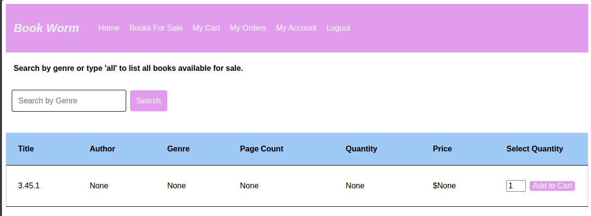

### Step 2 - Perform Database Reconnaissance on the Schema Table

With the database type discovered, database reconnaissance was performed to gather more information about the tables within the database. To accomplish this, the database's schema table (`sqlite_master`) was queried. This table contains details about the database's objects, including their types and names. General information about the table was obtained from SQLite's (n.d.) documentation. The UNION-based injection payload used to retrieve the names and types of database objects from the `sqlite_master` table is included below. Its corresponding output is also included, which demonstrates that the table names within the database were enumerated and recovered.

```
'UNION SELECT NULL, type, tbl_name, NULL, NULL, NULL, NULL FROM sqlite_master--
```

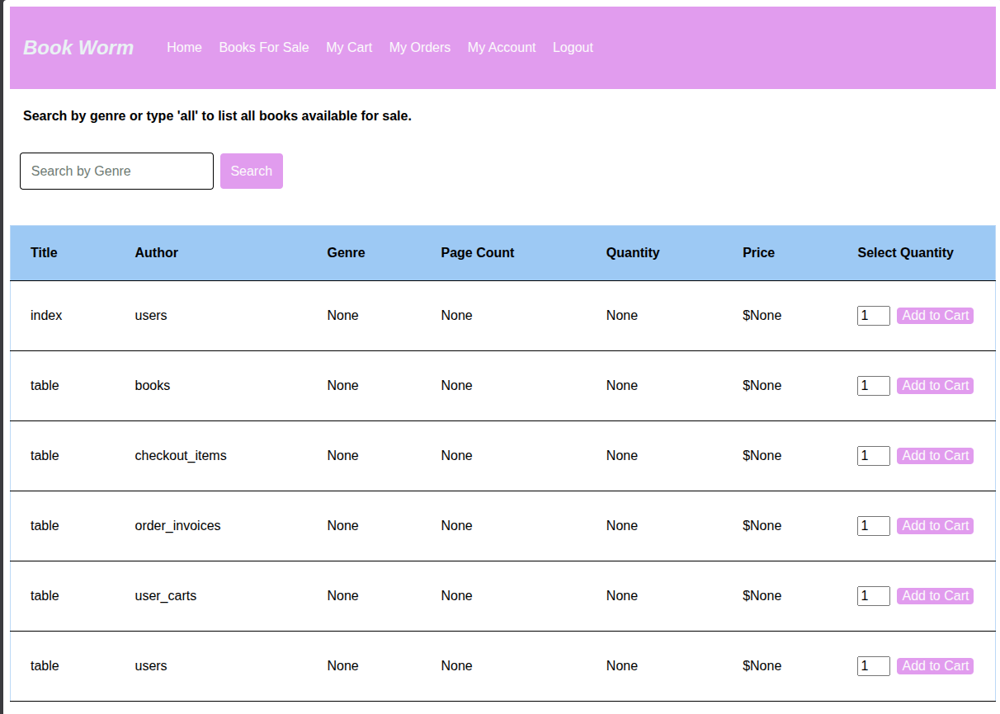

### Step 3 - Identify the Structure of the `users` Table

The previous exploitation step revealed that there was a table containing customer data, the `users` table. To discover what sensitive information from the `users` table could be targeted, the structure of the table needed to be determined. Using information about the schema table from SQLite's (n.d.) documentation, an injection payload was crafted to retrieve the structure of the table and its column names from the `sqlite_master` table. The following payload and a screenshot of its output demonstrate that the structure of the `users` table could be successfully obtained, providing insight into which columns should be targeted in future SQL injection attacks.

```
'UNION SELECT NULL, sql, NULL, NULL, NULL, NULL, NULL FROM sqlite_master WHERE tbl_name= 'users'--
```

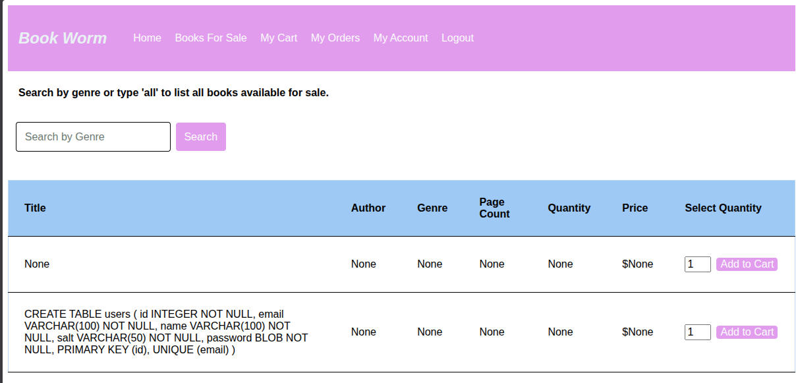

### Step 4 - Access Customer Data from the `users` Table

With the structure of the `users` table retrieved, sensitive customer data could be queried and extracted from the database for subsequent exploitation. The columns identified that were likely to contain sensitive and valuable customer information included the id, email, name, salt, and password fields. The following attack payload included these columns in the order they appear in the database to improve the readability of the output, which can be viewed after the payload.

```
'UNION SELECT NULL, id, email, name, salt, password, NULL FROM users--
```

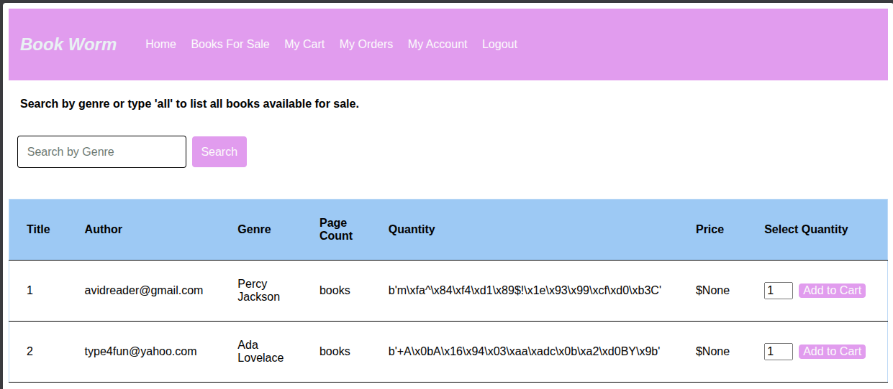

The successful database enumeration and subsequent extraction of customer data emphasizes the severity of the SQL injection vulnerability within the book genre search functionality, as sensitive user information can be easily gathered without proper authorization.

### Risk Analysis

The SQL injection vulnerability present in the book genre query introduces a significant security risk that damages Book Worm's confidentiality. Exploitation of this vulnerability within the application could result in the exposure of the entire database schema, which could enable further database reconnaissance and provide attackers with insight into the application's structural design. Alongside schema disclosure, sensitive user information may also be extracted, leading to unauthorized access to account data, user account compromise, and the wrongful disclosure of user information. This type of vulnerability is particularly damaging in an e-commerce application as the exposure of customer and account data can lead to significant privacy risks.

Although the primary impact of this vulnerability is the exposure of sensitive data, the bookstore's availability may also be affected. Large attack payloads or repeated injection attempts could consume a substantial amount of database resources, potentially degrading the system's performance or leading to a denial-of-service condition.

### General Remediation Advice

This vulnerability can be mitigiated by parametizing all SQL queries through SQLAlchemy's ORM querying methods instead of concatenating user input in queries using the text() function. Additionally, all input can be compared against an allow-list to validate user-supplied input.

# Weak Cryptographic Practices

## Overview and Vulnerable Code

The application implements weak cryptographic practices for password storage by hashing user passwords with the deprecated MD5 algorithm and a reused, statically stored salt. Although the application enforces a basic password policy, password complexity requirements alone do not provide password protection when combined with insecure hashing techniques. The use of MD5 is strongly discouraged because it is a deprecated, fast hashing algorithm that is susceptible to cracking with brute-force attacks (OWASP, 2025). While storing the salt "books" in the database is not considered a poor security practice, using a short, shared salt reduces its effectiveness (Defuse Security, n.d.). If the database is exposed, threat actors can obtain password hashes and the shared salt to recover user passwords using cracking tools and brute-force attack techniques as seen in the following demonstration.

#### The Vulnerable Code Snippet

The following code snippet is located in the [user_operations.py](../src/app/user_operations.py) module.

```
def hash_user_password(password):
    hash_salt = 'books'

    # Inspired by guidance from The Python Wiki (n.d.) on using the MD5 hashing function.
    hashed_password = hashlib.md5(
        hash_salt.encode('utf-8') + password.encode('utf-8')
    ).digest()
    return hash_salt, hashed_password

```

## Exploitation Walkthrough

### Preconditions and Required Materials

* The Flask application running locally
* At least one user account exists in the database (there were two user accounts for this demonstration)
* At least one recovered password binary (such as those discovered from the previous SQL injection exploit demonstration)
* Terminal access
* Python3 installed in the local environment
* Hashcat
* The [rockyou.txt](https://weakpass.com/wordlists/rockyou.txt) word list
* Stroz Friedberg's (2024) [password complexity rule list](https://github.com/strozfriedberg/sf-password-research/blob/main/rules/8-complex-1k.rule)

### Step 1 - Format Obtained Passwords for Hashcat

The password hashes and salt were obtained from the `users` table through a SQL injection attack shown in the previous exploit demonstration. However, the password hashes and the salt had to be formatted first before using Hashcat. Since Hashcat expects hashes to be in hexadecimal format, the raw password hash bytes were converted to hexadecimal with Python's `hex()` method in the terminal.

```
python3 -c 'print((b"+A\x0bA\x16\x94\x03\xaa\xadc\x0b\xa2\xd0BY\x9b").hex())'
2b410b41169403aaad630ba2d042599b

python3 -c 'print((b"m\xfa^\x84\xf4\xd1\x89$!\x1e\x93\x99\xcf\xd0\xb3C").hex())'
6dfa5e84f4d18924211e9399cfd0b343
```

After converting the password hashes to hexadecimal, they were stored in a text file with the retrieved salt appended to each hash using Hashcat's expected input format of `hash:salt`. This input format does not determine how Hashcat uses the salt during cracking, but rather it allows Hashcat to differentiate between the password hash and its salt. The text file, `password_hashes.txt`, stores each hash and its corresponding salt on separate lines so Hashcat can process them individually.

```
2b410b41169403aaad630ba2d042599b:books
6dfa5e84f4d18924211e9399cfd0b343:books
```

### Step 2 - Identify the Hashing Algorithm Used

Since the application's source code was not leaked, the hashing algorithm applied to the user passwords was initially unknown. To help identify the hashing algorithm used, Hashcat's `--identify` command was used to analyze the extracted password hashes. With the formatted `password_hashes.txt` file, the following command was executed:

```
hashcat --identify password_hashes.txt
```

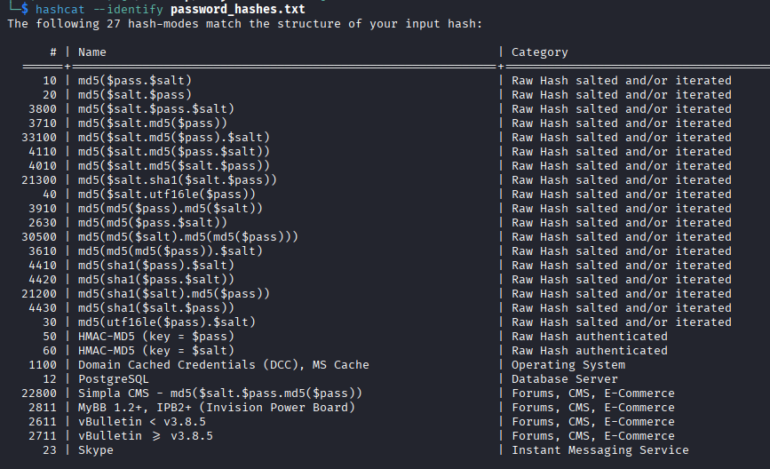

The command returned several possible hashing algorithms that could have been used to hash the passwords. Based on this output, along with the hashes matching a consistent length and hexadecimal format commonly associated with MD5, it was determined that the passwords were most likely hashed using the MD5 algorithm (The PHP Documentation Group, n.d.).

### Step 3 - Run Hashcat Against the Prepared Hashes

With the hashes and salt formatted in the `password_hashes.txt` file and several potential hash modes for MD5 identified, Hashcat can be used to crack the password hashes using a dictionary attack approach. Since the exact hashing configuration was not known, different Hashcat modes were tested. Through this process, it was discovered that mode 20, which corresponds to the MD5 algorithm with the salt appended before the password, produced successful results. The command used to crack the password hashes can be broken down as follows:

* `-m 20` selects the hashing mode which corresponds to the MD5 algorithm with the salt prepended to the password as previously mentioned.
* `-a 0` specifies the attack mode as a dictionary attack.
* `password_hashes.txt` contains the extracted password hashes with their salt values.
* `rockyou.txt` is comprised of commonly used passwords.
* `-r 8-comple-1k.rule` applies rule-based transformations to generate password variations that reflect common password patterns aligned with typical password complexity requirements.

The fully constructed Hashcat command to crack the user password hashes was:

```
hashcat -m 20 -a 0 password_hashes.txt rockyou.txt -r 8-complex-1k.rule
```

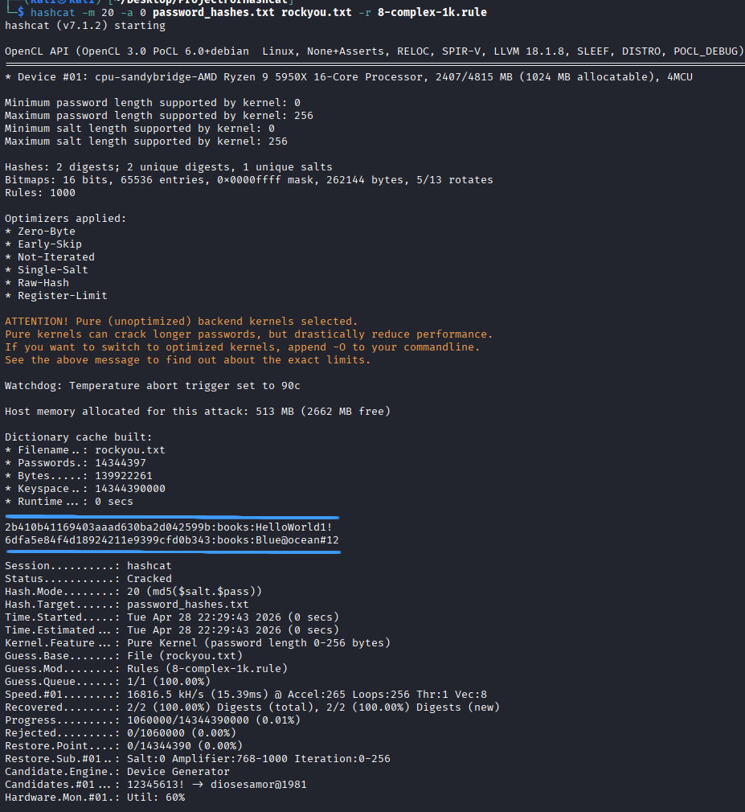

The command's output highlights that the two passwords recovered from the database, Blue@ocean#12 and HelloWorld1!, were successfully cracked. The successful recovery of the passwords highlights Book Worm's weak cryptographic practices with password storage.

## Risk Analysis

Weak password hashing creates an authentication risk that negatively impacts Book Worm's confidentiality and integrity. If attackers gain access to the database and obtain password hashes and the static salt, they can efficiently recover user passwords using common, readily available hash-cracking tools and simple attack techniques. Within the bookstore application, exploitation of this vulnerability can result in stolen user credentials, unauthorized access to user accounts, exposure of account and order information, and unauthorized account activities such as placing fraudulent orders or deleting a user's account. In a customer facing application, weak cryptographic practices for user credentials greatly increases the risk of user exploitation and reputational damage due to the exposure of customer information.

### General Remediation Advice

The risks from weak hashing methods can be avoided by hashing user passwords with modern algorithms such as Argon2 or ChaCha20 using unique salts.

# Insecure Direct Object Reference (IDOR)

## Overview and Vulnerable Code

Book Worm contains an access control flaw within the invoice viewing functionality, specifically an insecure direct object reference (IDOR) vulnerability. This vulnerability is a form of access control failure in which an application exposes references to database objects through modifiable identifiers without enforcing authorization checks to verify the requesting user is permitted to access the object (OWASP, 2024). With the invoice retrieval functionality, users can directly access invoice objects by modifying the order ID in the URL. This user-supplied ID is used in a database query that only filters by the provided ID and does not include the currently authenticated user's ID. As a result, ownership of the invoice is not enforced during retrieval, and the object is returned without performing any authorization checks that would verify the user is allowed to view the object. This enables any authenticated user to access invoices that are not associated with them and view sensitive order information. The following proof-of-concept demonstrates how a user can guess the IDs of orders in the sytem and enumerate them by modifiying the identifier in the URL.

#### The Vulnerable Code Snippets

The following code snippets from the [routes.py](../src/app/routes.py) file and its helper function located in the [shop_operations.py](../src/app/shop_operations.py) file were both necessary to implement the IDOR vulnerability.

```
From routes.py
@app.route('/user/orders/<int:invoice_id>', methods=['GET'])
@login_required
def view_order(invoice_id):
  
    invoice = get_buyer_invoice(invoice_id)
    invoice_checkout_items = invoice.cart.checkout_items
  
    return render_template('view_order.html', invoice = invoice, checkout_items = invoice_checkout_items)
```

```
From shop_operations.py
def get_buyer_invoice(invoice_id: int):  
    return Invoice.query.filter_by(id = invoice_id).first()
```

## Exploit Demonstration

### Preconditions and Required Materials

* The Flask application running locally
* A browser
* At least two user account exists in the database
* The user is authenticated in the application
* At least one order has been placed in the application by a user other than the currently authenticated one

### Step 1 - Identifying the Current Authenticated User's Orders

Upon viewing the orders page as an authenticated user, it can be observed that the current user has placed one order. Accessing the order using the "View Order Invoice" button directs the user to a page dedicated to viewing that specific invoice. On this webpage, the URL includes the order number, which indicates that the order number is used as an identifier to retrieve order invoices. The normal behavior of viewing the orders page and an individual invoice is included in the screenshots below.

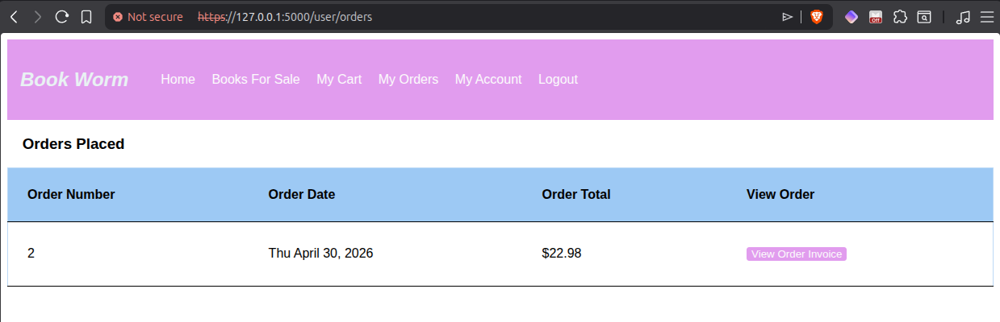

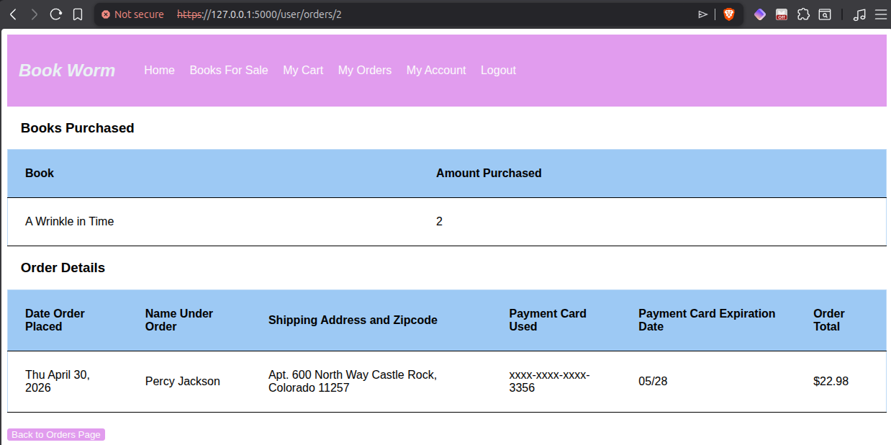

### Step 2 - Viewing Other User Orders

Since the currently authenticated user only has one order with an invoice identifier of 2, it can be inferred that there are other orders in the system with numeric identifiers, such as 1. Through observing that the application uses the order number in the URL to retrieve an invoice, it is possible to adjust the identifier to access other invoices in the system. By changing the identifier in the URL from 2 to 1, an invoice belonging to another user is displayed on the webpage. The modified URL and its output can be viewed below.

```
https://127.0.0.1:5000/user/orders/1
```

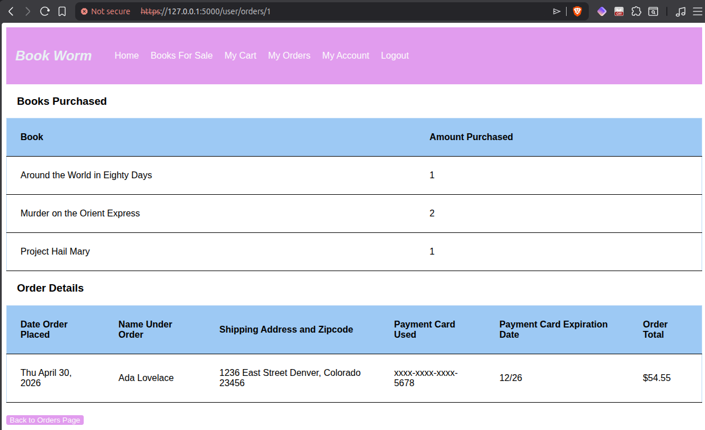

The successful retrieval of an order that was not placed by the currently authenticated user verifies the presence of a broken access control flaw within the order invoice viewing functionality.

### Risk Analysis

The IDOR vulnerability demonstrated in the previous exploit illustrates the impact this vulnerability has on Book Worm's confidentiality. To exploit this vulnerability, a threat actor only needs to create an account, authenticate themselves on the system, and discover the URL used to access individual order invoices. In Book Worm, exploiting this vulnerability could expose sensitive user information, including order payment details, user names, and addresses, resulting in significant privacy risks. This type of vulnerability can be very concerning in e-commerce platforms because users expect their order details and personal information to remain private and securely stored within the system.

### General Remediation Advice

Gathering the user ID in the `view_order` route and using it as a filter in the invoice query will mitigate the IDOR vulnerability because the user associated with the invoice can be properly validated prior to returning the invoice object.

# Cross-Site Request Forgery (CSRF)

## Overview and Vulnerable Code

The Book Worm Application contains several programming inconsistencies and configuration decisions that coalesce into a cross-site request forgery (CSRF) vulnerability. A CSRF vulnerability occurs when attackers can perform unintended, state-changing actions on behalf of an authenticated user by exploiting request verification mechanisms that rely on session cookies rather than token-based validation controls (PortSwigger, n.d.). With the bookstore implementation, CSRF protection is not consistently applied, and request validation is not enforced for the delete account functionality. Furthermore, automatic CSRF protection was disabled to support the custom CSRF validation function, and the application is configured to accept session cookies from cross-site requests. The custom CSRF protection function verifies CSRF tokens prior to processing form data, but this protection is applied only to selected routes and not to the `delete_account` route. Additionally, the delete account form does not include a CSRF token, meaning request verification relies solely on session cookies. As a result, forged requests originating from an external source can be processed as legitimate user requests, enabling unauthorized account deletion, as demonstrated in the upcoming proof-of-concept.

#### The Vulnerable Code Snippets and Configuration Settings

The following snippets in the [init.py](../src/app/__init__.py) file highlight the necessary configuration settings required to enable CSRF exploitation.

```
Configuration settings informed by Boucher (2022).
app.config['SESSION_COOKIE_SECURE'] = True
app.config['SESSION_COOKIE_SAMESITE'] = 'None'

# Custom CSRF protection implementation adapted from Flask-WTF's (n.d.) documentation.
from flask_wtf.csrf import CSRFProtect
csrf = CSRFProtect()
app.config["WTF_CSRF_CHECK_DEFAULT"] = False
csrf.init_app(app)
```

The code snippets show the inconsistent CSRF protections applied throughout the application, including the lack of a CSRF token on the account deletion form from the [user_account.html](../templates/user_account.html) file and that the delete_account endpoint being excluded in the CSRF protection list in the [routes.py](../src/app/routes.py) file.

```
From user_account.html
<div class="generic-form">
       <form method="post" action="{{ url_for('delete_account') }}">
           <!--The absense of a validation token makes this form vulnerable to a Cross-Site Request Forgery attack.-->
           <label>Name</label>
           <input type="text" name="name" value="{{user.name}}" disabled>
           <label>Email</label>
           <input type="text" name="email" value="{{user.email}}" disabled>
           <button type="submit">Delete Account</button>
       </form>
</div>
```

```
From routes.py
# Custom CSRF protection implementation adapted from Flask-WTF's (n.d.) documentation.
@app.before_request
def validate_csrf_manually():
    if request.endpoint in [
        'login', 'signup', 'logout', 'view_books', 'add_book_to_cart', 'complete_order'] \
        and request.method == 'POST':
            csrf.protect()
```

## Exploit Demonstration

### Preconditions and Required Materials

* The Flask application running locally
* A browser
* At least one user account exists in the database
* The user is authenticated in the application
* A Python web server
* An HTML file containing a form pointing that submits the POST request to the `/user/delete` endpoint

**Note:**

* To simulate a realistic CSRF attack scenario, a malicious webpage was hosted using Python's built-in HTTP server. Even though both the Book Worm application and the malicious webpage were hosted locally for demonstration purposes, they were running on different ports to represent separate applications so a cross-site request could me simulated. In a real-world scenario, the attacker would host this webpage publicly and attempt to trick the victim into visting it via a phishing email or a malicious link. For this demonstration, the interaction is simulated by manually navigating to the malicious webpage while a user is authenticated in Book Worm.

### Step 1 - Deploy a Python Web Server with a Malicious Webpage

To delete an authenticated user's account without accessing their account, a malicious webpage can be created and hosted using Python's built-in web server. This webpage must contain a form that sends a POST request to the `/user/delete` endpoint. This endpoint can be identified through application testing as an authenticated user or by exploring the application's web structure. When the form on the webpage is submitted, a POST request is sent to the target endpoint as long as Book Worm is actively running. The following Python command and HTML file demonstrate how the exploit is constructed and deployed.

```
Malicious HTML Webpage File
<h3>Oh no, looks like something went wrong trying to access that page on Book Worm!</h3>

<!--Malicious HTML form influenced by Boucher (2022).-->
<form hidden id="delete" action="https://127.0.0.1:5000/user/delete" method="post" novalidate>
</form>

<p>Click the button below to refresh the page and reload Book Worm</p>
<button onClick="deleteUserAccount()">Click to Refresh Page</button>

<script>
    function deleteUserAccount() {
        document.getElementById('delete').submit();
    }
</script>
```

```
Python Command executed to host the malicious webpage: python3 -m http.server
```

### Step 2 - Have the Authenticated User Visit the Malicious Webpage

To execute the CSRF attack, the user must access the malicious webpage while authenticated in Book Worm. The attack requires the user's session cookies to remain active, so the user has to stay authenticated in Book Worm in a separate browser tab. The image below shows the demonstration user, Ada Lovelace, actively authenticated in the system and viewing their orders.

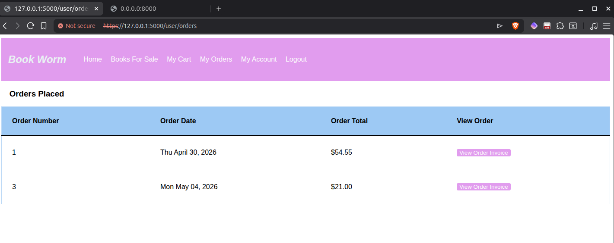

Next, the authenticated user must navigate from Book Worm to the malicious webpage hosted on the Python web server. For this demonstration, the user manually accessed the webpage in a separate browser tab. This webpage was designed to deceive the user that one of Book Worm's pages failed to load and then prompts the user to refresh the page. The user would assume that the webpage is legitimate because they are an active Book Worm customer and click the button. The malicious webpage is shown in the following image.

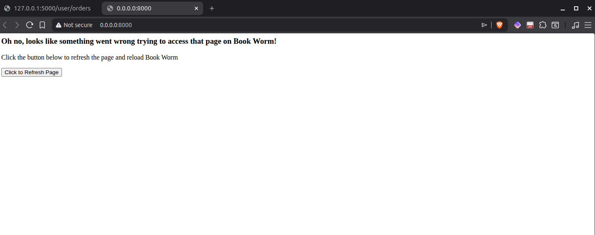

### Step 3 - Sending the Forged Request and Deleting the User's Account

With the authenticated user on the malicious webpage, the "Click to Refresh Page" button had to be clicked to submit the form that forges the POST request to the `/user/delete` endpoint. During form submission, the browser includes the authenticated user's session cookies with the request, which allows the request to be processed by the application as if it were a legitimate request from the user. Once this forged request was sent and processed, Ada Lovelace's account was deleted.

The now unauthenticated user was redirected to Book Worm's home page where a message was displayed indicating the account was deleted, and the UI was updated to display navigation options available only to unauthenticated users. The subsequent screenshot shows the user deletion message for the test user Ada Lovelace.

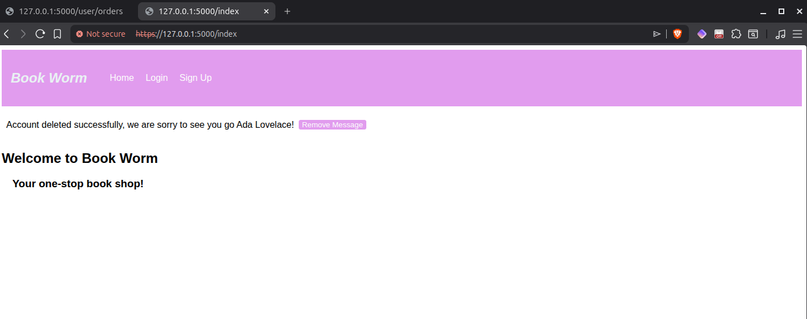

The deletion of Ada Lovelace's account proves that the `/user/delete` endpoint is vulnerable to forged requests because the application does not properly verify the origin of the account deletion request.

### Risk Analysis

The CSRF vulnerability present in the Book Worm application severely compromises the system's integrity. Although successful exploitation relies on several preliminary steps, including developing an exploitative webpage, hosting it, and tricking a user into sending the forged request, the CSRF attack can still be executed with minimal technical resources because the application fails to properly validate the origin of the delete account request. Successful exploitation of Book Worm's CSRF vulnerability results in the unauthorized deletion of user accounts, which negatively affects the reliability and integrity of the order records because the wrongfully deleted users are no longer associated with their orders. CSRF vulnerabilities similar to this can be particularly damaging in e-commerce platforms because sensitive user information and account details can be altered without the user's knowledge, eroding user trust in the platform and harming the reliability of stored data.

Additionally, an excessive amount of forged requests, whether valid or invalid, could degrade system performance or potentially create a denial-of-service condition. As a result, Book Worm's availability could be negatively impacted by the CSRF vulnerability as well.

### General Remediation Advice

The CSRF vulnerability in the application can be mitigated by ensuring all routes are included in the CSRF protection function and that all forms include valid CSRF tokens. Additionally, converting all HTML forms to Flask-WTF forms would also remediate this vulnerability because Flask-WTF automatically includes and validates CSRF tokens for POST requests.
